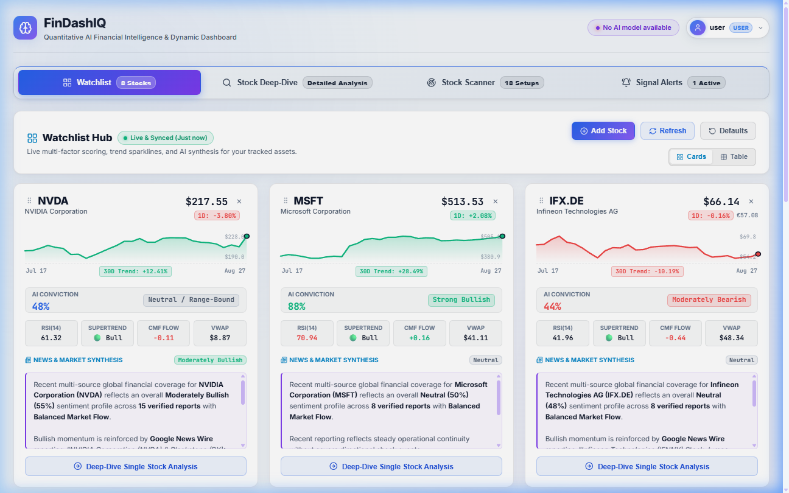

# ⚡ FinDashIQ

**Self-Hosted Financial Intelligence, Watchlist Hub & Quantitative Terminal**

> ⚠️ **Primary Purpose & Disclaimer**: FinDashIQ is designed primarily as a **self-hosted, private personal financial dashboard with artificial intelligence for private usage**. This platform is developed strictly for personal utility, educational exploration, and quantitative market research. **No liability or responsibility is assumed** for any financial, trading, or investment decisions, outcomes, losses, or software inaccuracies. Always perform your own due diligence.

<p align="center">
  
</p>

FinDashIQ provides a privacy-first, web-based financial analytics terminal that combines multi-factor quantitative indicators, persistent watchlist intelligence, dynamic strategy backtesting, automated AI investment synthesis, and real-time signal change notification rules. Built with a modular Python/Flask backend and a sleek glassmorphism frontend powered by ApexCharts and Lucide Icons.

---

## 🌟 Key Architecture & Features

### 1. 📊 Watchlist & Market Intelligence Hub (Top Tab 1 - Default)
- **Persistent Server-Side Storage**: Tracked stocks and ETF baskets are stored server-side (`data/watchlist.json`) in addition to local storage, surviving browser cache clears.
- **Default Asset Basket**: Pre-configured with major technology leaders and global index ETFs: `NVDA`, `MSFT`, `IFX.DE`, `TSM`, `SPCX`, `EXXT.DE` (iShares Nasdaq 100), and `XDWT.DE` (Xtrackers MSCI World Tech).
- **Interactive Asset Controls**: Quickly add new tickers (`+ Add Stock`), remove assets (`✕`), force refresh live data, or reset to defaults with one click.
- **Recommendation Mini-Cards Grid**:
  - **Live Price & Change Badge**: Real-time market quote and daily percentage change.
  - **Dynamic Trend Sparklines**: Responsive SVG price trajectory curves with gradient fills.
  - **AI Conviction & Stance Gauge**: Score (0–100%) and bias (*Strong Bullish*, *Bullish*, *Neutral*, *Bearish*).
  - **Quantitative Metric Bar**: Key values for RSI(14), SuperTrend status, Chaikin Money Flow (CMF), and Volume-Weighted Average Price (VWAP).
  - **AI News Catalyst & Sentiment Synthesis**: Executive synthesis of breaking market catalysts and sentiment.
  - **One-Click Deep-Dive Transition**: Seamlessly routes directly into the terminal with that single asset loaded.

---

### 2. 🔍 Stock Deep-Dive & Terminal (Top Tab 2)
Independent single-stock and multi-stock search terminal housing 4 specialized sub-tabs:

#### 🧠 Sub-Tab 1: Financial Intelligence & Copilot
- ** Conviction Gauge & Directional Bias**: Quantitative momentum score.
- **Executive Thesis & Tailwinds**: Fundamental drivers, key catalysts, and invalidation risk factors.
- **30-Day Probabilistic Scenarios**: Bull, Base, and Bear case target prices with scenario rationale.
- **Execution Matrix**: Dynamic entry zones, volatility-based stop-loss levels, asymmetric take-profit targets, and risk/reward ratios.
- **Live Real-Time Market News Feed**: Breaking headlines, publisher attribution, timestamps, and direct article links.
- **AI Market Catalyst Synthesis**: Dedicated LLM breakdown of current news sentiment and price drivers.
- **Interactive AI Copilot**: Context-aware chat assistant answering technical, strategic, and risk questions with fallback heuristics.

#### 📈 Sub-Tab 2: Dynamic Charts & Technical Oscillators
- **Primary Price Chart**: Candlestick and Area modes with timeframe selection (`1M`, `3M`, `6M`, `1Y`, `2Y`, `5Y`, `MAX`).
- **Dynamic Overlays**: SuperTrend (10, 3), Volume-Weighted Average Price (VWAP), SMA 20/50/200, EMA 20/50/200, Bollinger Bands (20, 2), and Keltner Channels (20, 1.5).
- **4 Sub-Oscillator Panels**:
  - **Stochastic Oscillator (14, 3, 3)** with overbought (>80) and oversold (<20) zones.
  - **Relative Strength Index (RSI 14)** with critical 70/30 thresholds.
  - **MACD (12, 26, 9)** with colored expansion/contraction histogram.
  - **Chaikin Money Flow (CMF 20)** measuring institutional accumulation vs. distribution.

#### 🧪 Sub-Tab 3: Strategy Backtesting & Order Execution Log
- **Multi-Strategy Simulation**: Test historical performance on **Multi-Factor Quant**, **SuperTrend**, or **MACD + RSI Momentum** strategies.
- **Performance Scorecards**: Total strategy return vs. Buy & Hold benchmark, Alpha, Win Rate, Profit Factor, and Max Drawdown.
- **Dynamic Equity Curve**: Visualizes portfolio compounding from $10,000 against market hold.
- **Simulated Order Execution Log**: Full ledger of entry/exit dates, prices, trade PnL ($ and %), and exact signal trigger rationale.

#### 🛡️ Sub-Tab 4: Multi-Factor Consensus & Fundamentals
- **Algorithmic Consensus Verdict**: Verdict rating (*Strong Buy*, *Buy*, *Neutral*, *Sell*, *Strong Sell*) backed by individual indicator signal breakdowns.
- **Visual Signal Meter**: Real-time distribution bar of bullish, neutral, and bearish technical signals.
- **Fundamental Statistics**: Market cap, Trailing and Forward P/E, Beta, Dividend Yield, Average Volume, ATR, and interactive 52-Week Price Range slider.

---

### 3. 🛰️ Quantitative Stock Scanner & Opportunity Discovery (Top Tab 3)
- **Uncovered Alpha Screener**: Automated radar designed specifically to uncover high-conviction buy recommendations for assets **not currently in the user's watchlist**.
- **Thematic & Ecological Universe**: Dedicated filtering across **Clean Energy & Solar/Wind Decarbonization**, **Pure AI & Quantum Silicon**, **Cybersecurity & Cloud Observability**, **Biotech & Genomics**, **Fintech**, and **Industrial Automation**.
- **Multi-Factor Indicator Concurrency**: Concurrently evaluates SuperTrend trendline support, RSI oversold dip-buys (<55), Chaikin Money Flow accumulation (>+0.05), and VWAP benchmark positioning.
- **Dynamic Trade Execution Matrix**: Automated entry zones, volatility stop-losses, take-profit targets (TP1), and risk/reward ratios.
- **Investment Thesis & ESG Scoring**: Contextual narrative breakdown with Elite/Leader ESG sustainability ratings.
- **1-Click Actions**: Instantly add discovered stocks to server-persisted watchlist (`+ Add to Watchlist`) or route directly into Terminal (`Deep-Dive →`).

---

### 4. 🔔 Signal Change Alerts & Notifications Hub (Top Tab 4)
- **Configurable Trigger Rules**:
  - **Target Asset**: Select from watchlist or enter custom ticker.
  - **Signal Conditions**: SuperTrend Trend Flips, AI Conviction shifts (>75% / <40%), MACD Golden/Death Crosses, RSI Oversold/Overbought (<30 / >70), CMF Institutional Accumulation (>+0.10), or Price Target / Stop-Loss breaches.
  - **Delivery Channels**: Telegram Bot, Email Webhook, Discord Webhook, Browser Push Notification.
- **Active Rule Manager**: Enable, pause, or delete rules with persistent server-side storage (`data/alerts.json`).
- **Simulated Trigger Testing**: Click **"Test"** on any rule to simulate and verify instant message delivery.
- **Live Notification Activity Log**: Real-time stream of dispatched alert messages.

---

### 5. 👤 Role-Based Authentication & User Profiles
- **Initial Admin Account**: Default administrator account initialized (`admin` / `admin123`) with instant password changing.
- **Admin-Only Account Creation**: Administrators can create new accounts (Admin or Standard User), assign roles, and manage the user directory. Normal users cannot add or delete accounts.
- **Per-User Isolated Storage**: Watchlists, notification rules, visual theme modes (Dark / Bright), and preferences are strictly isolated per user account.
- **Profile Modal & Top-Right Header**: Top-right user avatar badge with quick dropdown for Theme Mode toggle (Dark 🌙 / Bright ☀️), Profile & Preferences, AI Settings, Security/Password, and Admin User Management.

---

## 📁 Modular Project Structure

```
FinDashIQ/
├── app.py                      # Flask backend, API routing, auth & cache endpoints
├── requirements.txt            # Python dependencies
├── data/
│   ├── users.json              # Role-based user accounts & hashed credentials
│   ├── watchlist.json          # Persistent server-side watchlist configuration
│   ├── alerts.json             # Persistent signal alert rules & notification history
│   └── cache/                  # Server-side historical market data cache
├── services/
│   ├── stock_service.py        # Quotes, indicators, backtesting, delta download engine & cache
│   └── ai_service.py           # Gemini synthesis, scenario modeling & Copilot chat
├── static/
│   ├── css/
│   │   └── style.css           # Modern dark/bright glassmorphism theme & responsive layouts
│   └── js/
│       └── app.js              # Client state, ApexCharts renderers, sparklines & tab routing
└── templates/
    ├── index.html              # Master layout container
    ├── components/
    │   ├── header.html         # Interactive brand logo, status badge & user profile menu
    │   ├── top_nav.html        # Top-level 4-tab navigation bar (Watchlist, Terminal, Scanner, Alerts)
    │   ├── footer.html         # Footer branding, versioning, Impressum & creator badges
    │   ├── search_bar.html     # Terminal ticker search input and quick preset watchlists
    │   ├── stock_header.html   # Multi-stock selector tabs & hero quote card
    │   ├── nav_tabs.html       # Terminal 4-mode sub-tab navigation bar
    │   ├── ai_modal.html       # AI Provider (Gemini / OpenAI) configuration modal
    │   ├── profile_modal.html  # User profile, password management & admin controls
    │   ├── help_modal.html     # Comprehensive built-in help guide & keyboard shortcuts
    │   ├── impressum_modal.html# Legal notice & Impressum modal
    │   └── global_news_modal.html # Breaking global macroeconomic news digest
    └── tabs/
        ├── tab_watchlist.html     # Top Tab 1: Watchlist & Recommendation Hub
        ├── tab_terminal.html      # Top Tab 2: Stock Deep-Dive Terminal
        ├── tab_screener.html      # Top Tab 3: AI Quantitative Stock Scanner
        └── tab_notifications.html # Top Tab 4: Signal Change Alerts & Notifications Hub
```

---

## 💻 Installation & Setup Guide

### Prerequisites
- **Python 3.9+** (Python 3.10, 3.11, or 3.12 recommended)
- Modern web browser (Google Chrome, Microsoft Edge, Firefox, Brave, Safari)

---

### 🪟 Windows Installation (PowerShell / Command Prompt)

1. **Open PowerShell or Terminal** and navigate to your project directory:
   ```powershell
   cd C:\path\to\your\projects\FinDashIQ
   ```

2. **Create a virtual environment**:
   ```powershell
   python -m venv venv
   ```

3. **Activate the virtual environment**:
   - In PowerShell:
     ```powershell
     .\venv\Scripts\Activate.ps1
     ```
     *(If script execution is restricted, run: `Set-ExecutionPolicy -Scope Process -ExecutionPolicy Bypass`)*
   - In Command Prompt (`cmd.exe`):
     ```cmd
     venv\Scripts\activate.bat
     ```

4. **Upgrade pip and install dependencies**:
   ```powershell
   python -m pip install --upgrade pip
   pip install -r requirements.txt
   ```

5. **Start the application**:
   ```powershell
   python app.py
   ```

6. **Open your browser** and visit:
   ```
   http://localhost:5000
   --> Initially user:"admin" / password:"admin123" and user: "user" / password:"user1" are created
   --> Change the passwords for security reasons after first login (Top-right user avatar -> My Profile & Preferences -> Password & Security) and delete not necessary users (e.g. user/user1).
   ```

---

### 🐧 Linux (Ubuntu / Debian) Installation

1. **Update package lists and install Python prerequisites**:
   ```bash
   sudo apt update
   sudo apt install -y python3 python3-pip python3-venv git
   ```

2. **Navigate into the project directory**:
   ```bash
   cd /path/to/FinDashIQ
   ```

3. **Create and activate a virtual environment**:
   ```bash
   python3 -m venv venv
   source venv/bin/activate
   ```

4. **Upgrade pip and install dependencies**:
   ```bash
   pip install --upgrade pip
   pip install -r requirements.txt
   ```

5. **Run the application**:
   ```bash
   python3 app.py
   ```

6. **Open in browser**:
   ```
   http://localhost:5000
   --> Initially user:"admin" / password:"admin123" and user: "user" / password:"user1" are created
   --> Change the passwords for security reasons after first login (Top-right user avatar -> My Profile & Preferences -> Password & Security) and delete not necessary users (e.g. user/user1).
   ```

#### 🛡️ Optional: Running as a Background Service with Systemd (Ubuntu)

Assumption: the user is "ubuntu" (you can change it in the systemd file to your user name).

```ini
[Unit]
Description=FinDashIQ
After=network.target

[Service]
User=ubuntu
WorkingDirectory=/home/ubuntu/FinDashIQ
ExecStart=/home/ubuntu/FinDashIQ/venv/bin/gunicorn --bind 0.0.0.0:5000 --workers 4 --threads 4 --timeout 120 app:app
Restart=always
RestartSec=5
Environment=PYTHONUNBUFFERED=1

[Install]
WantedBy=multi-user.target
```

---

## 🛠️ Tech Stack

- **Backend**: Python 3.9+, Flask, Pandas, NumPy, yfinance, Gunicorn
- **Frontend**: HTML5, Vanilla Modern CSS (CSS Grid, Flexbox, Glassmorphism), Vanilla JavaScript (ES6+)
- **Visualization**: [ApexCharts.js](https://apexcharts.com/) for reactive financial charting & inline SVG Sparklines
- **Icons**: [Lucide Icons](https://lucide.dev/)

---

## 📖 Documentation & Project Wiki

Comprehensive documentation, architectural guides, and integration tutorials are available in the official **[FinDashIQ GitHub Wiki](https://github.com/TheyAreMe/FinDashIQ/tree/main/wiki)**:

- 📖 **[Project Wiki Home](https://github.com/TheyAreMe/FinDashIQ/tree/main/wiki)** — Full knowledge base, setup walk-throughs, and architecture overviews.
- 🔔 **[Configuring the Notification Section](https://github.com/TheyAreMe/FinDashIQ/tree/main/wiki/Configuring-Notifications)** — Step-by-step alert configuration, multi-factor indicator types, thresholds, rule lifecycle, and test simulation.
- 📱 **[Telegram Bot Setup Guide](https://github.com/TheyAreMe/FinDashIQ/tree/main/wiki/Telegram-Bot-Setup)** — Setting up bots via `@BotFather`, obtaining Chat IDs, and dispatching alerts.
- 💬 **[Discord Webhook Integration](https://github.com/TheyAreMe/FinDashIQ/tree/main/wiki/Discord-Webhook-Setup)** — Setting up webhooks and formatting Discord trading channel embeds.
- 🌐 **[Custom API & Email Webhooks](https://github.com/TheyAreMe/FinDashIQ/tree/main/wiki/Custom-API-and-Email-Webhooks)** — JSON payload schemas and connecting to external trading bots, Zapier, and n8n.

---

## ⚠️ Disclaimer & Limitation of Liability

- **Private & Personal Usage Only**: The primary purpose and objective of FinDashIQ is to serve as a **self-hosted, sovereign financial dashboard with intelligence for private personal usage**, self-directed monitoring, and educational quantitative research.
- **No Financial Advice**: FinDashIQ and its generated AI analyses, algorithmic consensus verdicts, technical indicator signals, backtesting models, and alerts do **not** constitute financial, investment, legal, or tax advice.
- **No Liability**: The authors, contributors, and maintainers accept **no liability or responsibility whatsoever** for any direct, indirect, special, or consequential damages, losses, lost profits, or trade outcomes resulting from the use of this software or reliance on any calculations, third-party market data, automated heuristics, or AI responses.
- **Data Accuracy & Verification**: Market quotes, historical data, and fundamentals are fetched from external public APIs. Completeness, uninterrupted service, or real-time precision cannot be guaranteed. Users are strictly responsible for conducting independent due diligence and consulting certified financial professionals before executing financial trades.

---

## 📄 License
This project is open-source and available under the [MIT License](LICENSE).

---

## ☕ Support the Project

If you find FinDashIQ valuable for you, consider supporting its open-source development:

<a href="https://ko-fi.com/theyareme" target="_blank"></a>&nbsp;&nbsp;<a href="https://www.buymeacoffee.com/theyareme" target="_blank"></a>


