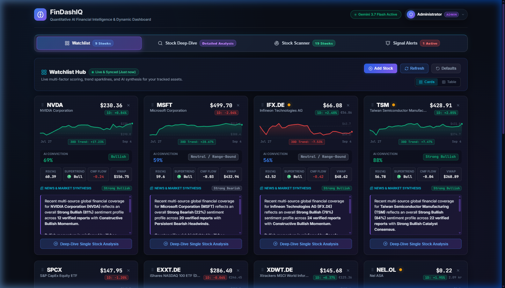
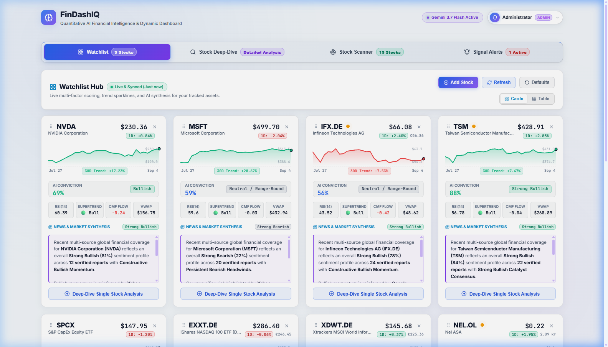
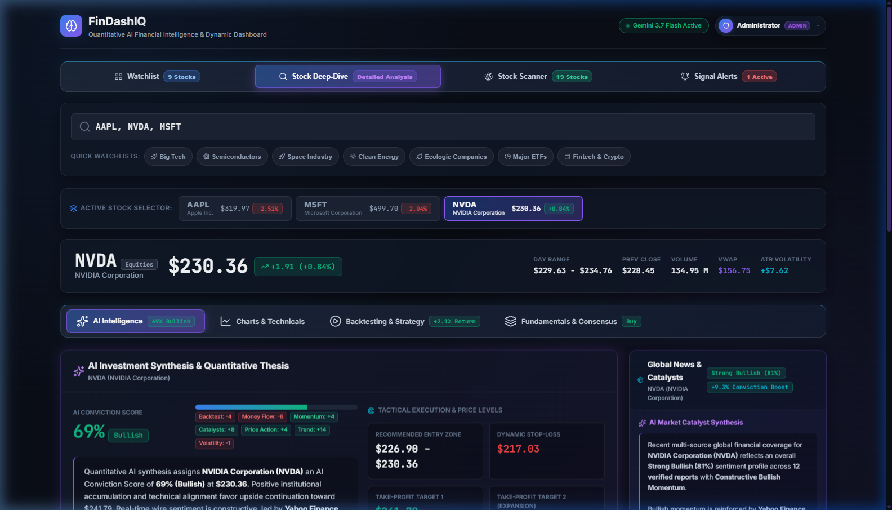
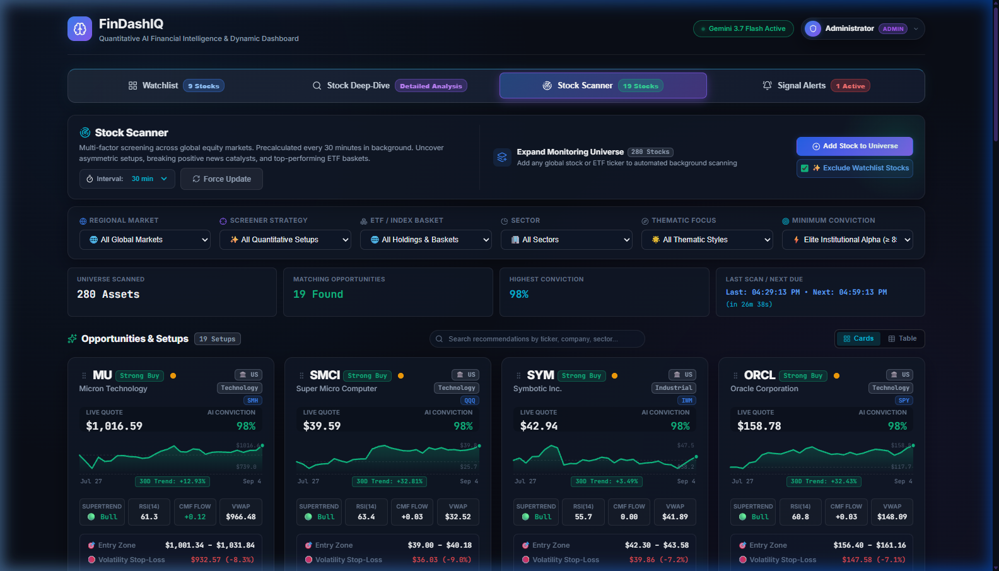
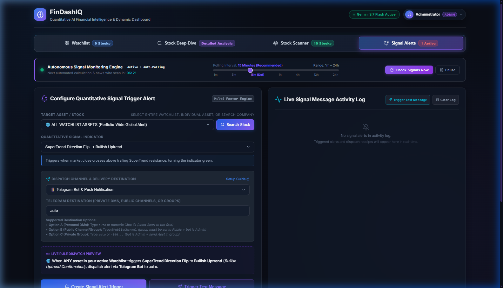

# ⚡ FinDashIQ

**Self-Hosted Financial Intelligence, Watchlist Hub & Quantitative Terminal**

> ⚠️ **Primary Purpose & Disclaimer**: FinDashIQ is designed primarily as a **self-hosted, private personal financial dashboard with artificial intelligence for private usage**. This platform is developed strictly for personal utility, educational exploration, and quantitative market research. **No liability or responsibility is assumed** for any financial, trading, or investment decisions, outcomes, losses, or software inaccuracies. Always perform your own due diligence.

<details>
  <summary><b>🌙 Dark Mode (Default)</b> <i>(Click to expand / switch)</i></summary>
  <p align="center">
    
  </p>
</details>

<details>
  <summary><b>☀️ Bright Mode</b> <i>(Click to expand / switch)</i></summary>
  <p align="center">
    
  </p>
</details>

FinDashIQ provides a privacy-first, web-based financial analytics terminal that combines multi-factor quantitative indicators, persistent watchlist intelligence, dynamic strategy backtesting, automated AI investment synthesis, and real-time signal change notification rules. Built with a modular Python/Flask backend and a sleek glassmorphism frontend powered by ApexCharts and Lucide Icons.

---

## 🌟 Key Architecture & Features

### 1. 📊 Watchlist & Market Intelligence Hub (Tab 1)

<p align="center">
  
</p>

* **Persistent Server-Side Storage**: Tracked stocks and ETF baskets survive browser cache clears (`data/watchlist.json`).
* **Live Quotes & Sparklines**: Real-time pricing, 1-day change deltas, and 30-day SVG trend sparklines.
* **AI Conviction & Multi-Source Synthesis**: Quant momentum scoring (0–100%) paired with live breaking news synthesis.
* **Quantitative Indicators**: At-a-glance metrics for SuperTrend, RSI(14), Chaikin Money Flow (CMF), and VWAP.
* **1-Click Deep-Dive**: Direct routing into the technical analysis terminal for any tracked asset.

---

### 2. 🔍 Stock Deep-Dive & Quantitative Terminal (Tab 2)

<p align="center">
  
</p>

* **AI Intelligence & Copilot**: Execution matrix (entry zone, volatility stop-loss, take-profit targets), 30-day probabilistic scenarios, and interactive AI market copilot.
* **Dynamic Charts & Oscillators**: Candlestick & area charts powered by ApexCharts with SuperTrend, VWAP, Bollinger Bands, and sub-panels for RSI, MACD, Stochastic, and CMF.
* **Strategy Backtesting**: Simulate Multi-Factor Quant, SuperTrend, or MACD+RSI strategies against Buy & Hold with full equity curves and trade ledger.
* **Consensus & Fundamentals**: Multi-factor signal consensus meter (*Strong Buy* to *Strong Sell*), valuation multiples, and 52-week price range.

---

### 3. 🛰️ Autonomous Stock Scanner (Tab 3)

<p align="center">
  
</p>

* **Autonomous Background Screening**: Background engine screens 280+ global equities on configurable schedules without frontend dependencies.
* **Multi-Market & Thematic Filters**: Screen by region (US, Europe, Asia, Clean Energy), sector, and parent ETF baskets (SPY, QQQ, SMH, etc.).
* **High-Conviction Setups**: Immediate filtering for elite asymmetric setups (≥ 85% conviction) with automated entry zones and stop-loss levels.
* **Admin Controls & Local Timezone Sync**: Live countdown timer and "Last Scan / Next Due" display formatted in your local browser timezone.

---

### 4. 🔔 Signal Alerts & Notifications Hub (Tab 4)

<p align="center">
  
</p>

* **Multi-Factor Trigger Rules**: Alerts based on SuperTrend flips, AI conviction shifts, MACD crosses, RSI oversold/overbought, or target price breaches.
* **Omnichannel Delivery**: Automated dispatch via Telegram Bot, Discord Webhooks, Email, or Browser Push Notifications.
* **Simulator & Activity Ledger**: One-click test button to verify webhook delivery and review real-time notification logs.

---

### 5. 👤 Role-Based Authentication & Multi-User Support

* **Administrator & User Roles**: Role-based access control with separate permissions and user directory management.
* **Per-User Isolation**: Watchlists, alert rules, and visual theme preferences (Dark 🌙 / Bright ☀️) are strictly isolated per account.
* **Bring-Your-Own-Key (BYOK)**: Secure in-app AI settings supporting custom Gemini and OpenAI API keys.

---

## 📁 Modular Project Structure

```
FinDashIQ/
├── app.py                      # Flask backend, API routing, auth & cache endpoints
├── requirements.txt            # Python dependencies
├── data/
│   ├── users.json              # Role-based user accounts & hashed credentials
│   ├── watchlist.json          # Persistent server-side watchlist configuration
│   ├── alerts.json             # Persistent signal alert rules & notification history
│   └── cache/                  # Server-side historical market data cache
├── services/
│   ├── stock_service.py        # Quotes, indicators, backtesting, delta download engine & cache
│   └── ai_service.py           # Gemini synthesis, scenario modeling & Copilot chat
├── static/
│   ├── css/
│   │   └── style.css           # Modern dark/bright glassmorphism theme & responsive layouts
│   └── js/
│       └── app.js              # Client state, ApexCharts renderers, sparklines & tab routing
└── templates/
    ├── index.html              # Master layout container
    ├── components/
    │   ├── header.html         # Interactive brand logo, status badge & user profile menu
    │   ├── top_nav.html        # Top-level 4-tab navigation bar (Watchlist, Terminal, Scanner, Alerts)
    │   ├── footer.html         # Footer branding, versioning, Impressum & creator badges
    │   ├── search_bar.html     # Terminal ticker search input and quick preset watchlists
    │   ├── stock_header.html   # Multi-stock selector tabs & hero quote card
    │   ├── nav_tabs.html       # Terminal 4-mode sub-tab navigation bar
    │   ├── ai_modal.html       # AI Provider (Gemini / OpenAI) configuration modal
    │   ├── profile_modal.html  # User profile, password management & admin controls
    │   ├── help_modal.html     # Comprehensive built-in help guide & keyboard shortcuts
    │   ├── impressum_modal.html# Legal notice & Impressum modal
    │   └── global_news_modal.html # Breaking global macroeconomic news digest
    └── tabs/
        ├── tab_watchlist.html     # Top Tab 1: Watchlist & Recommendation Hub
        ├── tab_terminal.html      # Top Tab 2: Stock Deep-Dive Terminal
        ├── tab_screener.html      # Top Tab 3: AI Quantitative Stock Scanner
        └── tab_notifications.html # Top Tab 4: Signal Change Alerts & Notifications Hub
```

---

## 💻 Installation & Setup Guide

### Prerequisites
- **Python 3.9+** (Python 3.10, 3.11, or 3.12 recommended)
- Modern web browser (Google Chrome, Microsoft Edge, Firefox, Brave, Safari)

---

### 🪟 Windows Installation (PowerShell / Command Prompt)

1. **Open PowerShell or Terminal** and navigate to your project directory:
   ```powershell
   cd C:\path\to\your\projects\FinDashIQ
   ```

2. **Create a virtual environment**:
   ```powershell
   python -m venv venv
   ```

3. **Activate the virtual environment**:
   - In PowerShell:
     ```powershell
     .\venv\Scripts\Activate.ps1
     ```
     *(If script execution is restricted, run: `Set-ExecutionPolicy -Scope Process -ExecutionPolicy Bypass`)*
   - In Command Prompt (`cmd.exe`):
     ```cmd
     venv\Scripts\activate.bat
     ```

4. **Upgrade pip and install dependencies**:
   ```powershell
   python -m pip install --upgrade pip
   pip install -r requirements.txt
   ```

5. **Start the application**:
   ```powershell
   cp .env.example .env (Do not forget to replace the example tokens with your own tokens!)
   python app.py
   ```

6. **Open your browser** and visit:
   ```
   http://localhost:5000
   --> Initially user:"admin" / password:"admin123" and user: "user" / password:"user1" are created
   --> Change the passwords for security reasons after first login (Top-right user avatar -> My Profile & Preferences -> Password & Security) and delete not necessary users (e.g. user/user1).
   ```

---

### 🐧 Linux (Ubuntu / Debian) Installation

1. **Update package lists and install Python prerequisites**:
   ```bash
   sudo apt update
   sudo apt install -y python3 python3-pip python3-venv git
   ```

2. **Navigate into the project directory**:
   ```bash
   cd /path/to/FinDashIQ
   ```

3. **Create and activate a virtual environment**:
   ```bash
   python3 -m venv venv
   source venv/bin/activate
   ```

4. **Upgrade pip and install dependencies**:
   ```bash
   pip install --upgrade pip
   pip install -r requirements.txt
   ```

5. **Run the application**:
   ```bash
   cp .env.example .env (Do not forget to replace the example tokens with your own tokens!)
   python3 app.py
   ```

6. **Open in browser**:
   ```
   http://localhost:5000
   --> Initially user:"admin" / password:"admin123" and user: "user" / password:"user1" are created
   --> Change the passwords for security reasons after first login (Top-right user avatar -> My Profile & Preferences -> Password & Security) and delete not necessary users (e.g. user/user1).
   ```

#### 🛡️ Optional: Running as a Background Service with Systemd (Ubuntu)

Assumption: the user is "ubuntu" (you can change it in the systemd file to your user name).

```ini
[Unit]
Description=FinDashIQ
After=network.target

[Service]
User=ubuntu
WorkingDirectory=/home/ubuntu/FinDashIQ
ExecStart=/home/ubuntu/FinDashIQ/venv/bin/gunicorn --bind 0.0.0.0:5000 --workers 4 --threads 4 --timeout 120 app:app
Restart=always
RestartSec=5
Environment=PYTHONUNBUFFERED=1

[Install]
WantedBy=multi-user.target
```

---

## 🛠️ Tech Stack

- **Backend**: Python 3.9+, Flask, Pandas, NumPy, yfinance, Gunicorn
- **Frontend**: HTML5, Vanilla Modern CSS (CSS Grid, Flexbox, Glassmorphism), Vanilla JavaScript (ES6+)
- **Visualization**: [ApexCharts.js](https://apexcharts.com/) for reactive financial charting & inline SVG Sparklines
- **Icons**: [Lucide Icons](https://lucide.dev/)

---

## 📖 Documentation & Project Wiki

Comprehensive documentation, architectural guides, and integration tutorials are available in the official **[FinDashIQ GitHub Wiki](https://github.com/TheyAreMe/FinDashIQ/tree/main/wiki)**:

- 📖 **[Project Wiki Home](https://github.com/TheyAreMe/FinDashIQ/tree/main/wiki/Home.md)** — Full knowledge base, setup walk-throughs, and architecture overviews.
- 🔔 **[Configuring Notifications & Global Watchlist](https://github.com/TheyAreMe/FinDashIQ/tree/main/wiki/Configuring-Notifications.md)** — Multi-factor indicator alerts, portfolio-wide watchlist monitoring (`*WATCHLIST*`), and rule lifecycles.
- 📱 **[Telegram Bot Setup Guide](https://github.com/TheyAreMe/FinDashIQ/tree/main/wiki/Telegram-Bot-Setup.md)** — Setting up bots via `@BotFather`, obtaining Chat IDs, and direct server messaging.
- 💬 **[Discord Webhook Integration](https://github.com/TheyAreMe/FinDashIQ/tree/main/wiki/Discord-Webhook-Setup.md)** — Setting up webhooks and formatting Discord trading channel embeds.
- 📧 **[Email & SMTP Setup Guide](https://github.com/TheyAreMe/FinDashIQ/tree/main/wiki/Email-and-SMTP-Setup.md)** — Direct SMTP outbound configuration (`.env`) and HTML executive memos.
- 🔔 **[Browser Push & Audio Alerts](https://github.com/TheyAreMe/FinDashIQ/tree/main/wiki/Browser-Push-and-Audio-Alerts.md)** — HTML5 desktop notifications and Web Audio synthesizer chimes.
- 🌐 **[Custom REST API Webhooks](https://github.com/TheyAreMe/FinDashIQ/tree/main/wiki/Custom-API-Webhooks.md)** — JSON payload schemas and connecting to external trading bots, Zapier, and n8n.

---

## ⚠️ Disclaimer & Limitation of Liability

- **Private & Personal Usage Only**: The primary purpose and objective of FinDashIQ is to serve as a **self-hosted, sovereign financial dashboard with intelligence for private personal usage**, self-directed monitoring, and educational quantitative research.
- **No Financial Advice**: FinDashIQ and its generated AI analyses, algorithmic consensus verdicts, technical indicator signals, backtesting models, and alerts do **not** constitute financial, investment, legal, or tax advice.
- **No Liability**: The authors, contributors, and maintainers accept **no liability or responsibility whatsoever** for any direct, indirect, special, or consequential damages, losses, lost profits, or trade outcomes resulting from the use of this software or reliance on any calculations, third-party market data, automated heuristics, or AI responses.
- **Data Accuracy & Verification**: Market quotes, historical data, and fundamentals are fetched from external public APIs. Completeness, uninterrupted service, or real-time precision cannot be guaranteed. Users are strictly responsible for conducting independent due diligence and consulting certified financial professionals before executing financial trades.

---

## 📄 License
This project is open-source and available under the [MIT License](LICENSE).

---

## ☕ Support the Project

If you find FinDashIQ valuable for you, consider supporting its open-source development:

<a href="https://ko-fi.com/theyareme" target="_blank"></a>&nbsp;&nbsp;<a href="https://www.buymeacoffee.com/theyareme" target="_blank"></a>


